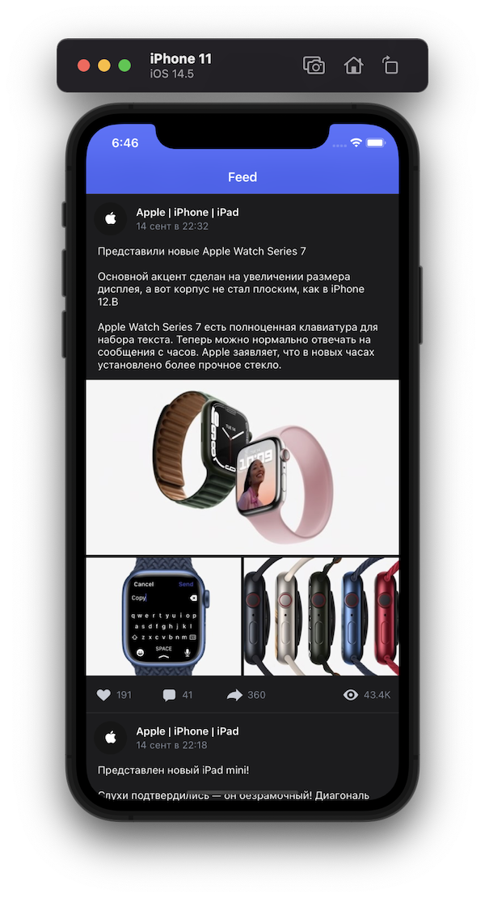

# Heads-Hands-Test-Assignment
iOS Test Task from [Heads &amp; Hands](https://handh.ru)

## Demo

<table  align="center">
    <tr>
        <th>Dark Theme</th>
        <th>Light Theme</th>
     </tr>
     <tr>
          <td></td>
          <td></td>
     </tr>
</table>

## Installation

Being In terminal, navigate to the project folder and install carthage dependencies:

`carthage update --platform iOS` 
Add `--use-xcframeworks` attribute if you're using M1 mac

## Made by [Kirill Pustovalov](https://github.com/IrelDev)

Website: https://ireldev.github.io 
Github: https://github.com/IrelDev
